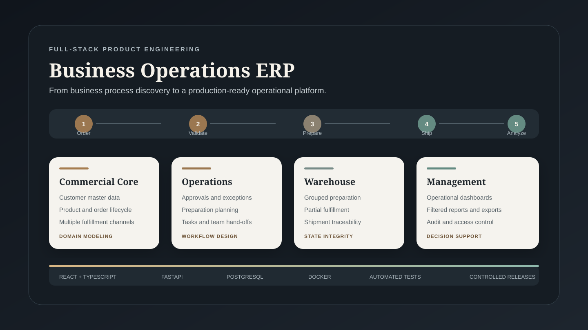
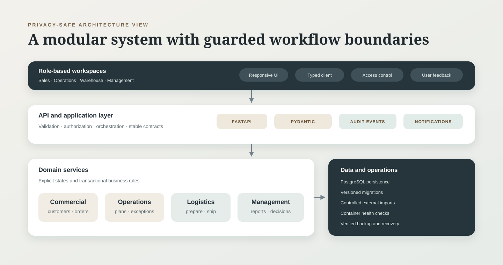

# Business Operations ERP — Engineering Case Study

> A privacy-safe overview of a production business system. Client identity, source code, infrastructure details, credentials, business data, and proprietary rules are intentionally excluded.



## What I built

I designed and delivered a full-stack ERP-style platform that connects commercial and operational workflows in one auditable system.

The product brings together:

- Customer and account master data
- Order intake and multi-channel fulfillment
- Warehouse preparation and shipment workflows
- Field activity and task management
- Role-based workspaces and approvals
- Operational reporting and management summaries
- Historical data imports and reconciliation processes
- Audit trails, document handling, backups, and controlled releases

This repository is a **case study, not the production application**. The visuals use synthetic labels and deliberately simplified flows.

## The engineering problem

The main challenge was not building isolated forms. It was converting a multi-team business process into a coherent stateful system while preserving:

- A single source of truth for shared records
- Clear ownership between sales, operations, and warehouse teams
- Safe transitions between order, preparation, and shipment stages
- Traceability for critical user actions
- Idempotent imports and protection against duplicate processing
- Compatibility with existing operational data
- A compact desktop experience with practical mobile behavior

## Solution architecture



The implementation follows a layered modular architecture:

- **Frontend:** React, TypeScript, Vite, typed API clients, reusable UI patterns
- **Backend:** FastAPI, Pydantic validation, service and repository layers
- **Data:** PostgreSQL, SQLAlchemy, Alembic migrations
- **Operations:** Docker Compose, reverse proxy, health checks, verified backups
- **Quality:** automated backend and frontend tests, workflow regression scenarios, controlled data migrations

## Representative workflow

```text
Order intake
    → commercial validation
    → preparation planning
    → warehouse execution
    → shipment and delivery tracking
    → reporting and audit history
```

The workflow supports grouped and partial operations, cancellations, external fulfillment reconciliation, and status histories without exposing those internal rules in this public repository.

## My contribution

I worked across the complete product lifecycle:

1. Business process discovery and requirement modeling
2. Domain and database design
3. Backend services and API contracts
4. Frontend information architecture and responsive UX
5. Legacy and operational data migration
6. Authorization, validation, and auditability
7. Automated testing and regression control
8. Production deployment, backup, monitoring, and hotfix workflows

## Engineering decisions highlighted

- Domain transitions are validated on the server rather than inferred from the interface.
- Financial and operational totals are calculated from canonical records instead of duplicated dashboard values.
- External imports use stable references and duplicate-processing protection.
- Destructive corrections are replaced with auditable status changes or compensating operations where required.
- Database changes are versioned and deployed through additive migrations.
- Production releases preserve business data and include a verified recovery point.

## What this repository demonstrates

This case study is intended to demonstrate:

- Full-stack product engineering
- Business systems and workflow design
- Relational data modeling
- API and integration architecture
- Operational reliability and release discipline
- Turning ambiguous business needs into a maintainable product

For a concise discussion of the approach, see [Engineering Notes](docs/engineering-notes.md).

## Confidentiality boundary

This public repository contains no:

- Production source code or database schema
- Customer, employee, order, or financial records
- Client name, branding, domains, IP addresses, or infrastructure identifiers
- API keys, credentials, environment files, backups, or deployment scripts
- Proprietary formulas, pricing rules, mappings, or integration contracts
- Screenshots captured from the live application

All diagrams are purpose-built, synthetic, and intentionally high level.

## Repository status

Documentation-only portfolio artifact. It is not distributed as a runnable product and does not grant a license to the underlying private implementation.

